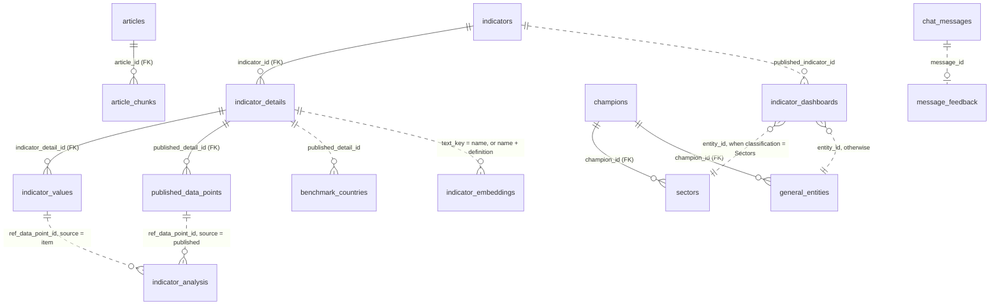

# Data model

23 tables in three layers, and **only 6 of them declare a foreign key**. The
rest are joined on conventions that exist in the source export rather than in
the schema, and those conventions are where the joins go wrong. This document
is mostly about them.

Kept beside `etl/schema.sql`; if you change one, change the other.

---

## The three layers

| Layer | Tables | Written by |
|---|---|---|
| **Source** — everything SCAI tracks, 531 indicators | `indicators`, `indicator_details`, `indicator_values`, `indicator_analysis` | the ETL |
| **Published** — the 189 SCAI has reviewed, with units, polarity and vetted YoY | `published_data_points`, plus the `published_*` columns on the two above | the ETL |
| **Application** — what the assistant itself produces | `chat_messages`, `message_feedback`, `indicator_embeddings`, `article_chunks` | the app and the index scripts |

The app answers from the **published** layer and falls back to source data only
when an indicator is not published. Application tables are never truncated by
the ETL: a data reload must not delete what users said.

---

## Diagram



Solid lines are enforced foreign keys. Dotted lines are joins the code makes
that the database does not enforce — a wrong id there returns nothing rather
than raising.

---

## The traps

### 1. An indicator has TWO different ids, and the data points use the second

`indicator_details` carries both:

- `indicator_detail_id` — the source id, from `Item_4`
- `published_detail_id` — a **different GUID**, from `P02`

`published_data_points` can only be queried by `published_detail_id`. Passing
the source id matches zero rows, and because the retriever only falls back to
`indicator_values` when the published id is `None`, a non-empty *wrong* id also
suppresses the fallback. Every data question then answers "no approved data
points were found", for every indicator.

This has broken the product once. It is the single most expensive mistake
available in this schema.

### 2. `is_main` decides which detail is the headline

One indicator can have several details. Real GDP has three — the total plus its
hydrocarbon and non-hydrocarbon components — and all three carry the parent's
name. Without `AND d.is_main IS TRUE`, a list of indicators shows Real GDP three
times with different numbers and no way to tell them apart.

`is_main` is 1:1 with the published indicators: 189 true, 100 false.

**But it is not always the headline.** For 14 indicators it marks one row out of
several, and for 7 of those the row is a plain component — `Workforce
(Economically Active)` → `High Skilled Blue Collar`, `Minimum Reserves of
Strategic Commodities` → `Onions`. The app detects this and labels the reading
as a component (`component_label` in `app/compute/engine.py`). Do not assume
`is_main` means "the total".

### 3. `indicator_dashboards.entity_id` is polymorphic

It points at `sectors.sector_id`, `general_entities.entity_id`, or others,
depending on `entity_classification_name`:

```
'Sectors' | 'SpecialEntities' | 'SpecialProjects' |
'DiversificationTargets' | 'Enablers' | 'Drivers' | 'NationalIndicators'
```

No single FK is possible. Always filter on the classification before joining,
or you will match ids across entity types by coincidence.

### 4. `indicator_analysis.ref_data_point_id` is polymorphic too

`source` says which table it points at:

- `'published'` → `published_data_points.published_data_point_id`
- `'item'` → `indicator_values.value_id`

Published rows carry the richer bilingual commentary; source rows are English
only. When a point has both, prefer the published one.

### 5. GUID case

The CMS files write the same GUID upper-case in one export and lower-case in
another. The ETL normalises case on load (`normalize_guid`). Before it did,
sector joins matched 0 of 210 rows.

### 6. `message_feedback.message_id` has no foreign key, on purpose

A rating can arrive for a message that was never logged — the logger is
best-effort and swallows its own failures, because a logging error must not
cost a user their answer. A foreign key would reject the rating instead, which
is the wrong trade: the rating is the scarcer thing.

The question and answer are **copied into** the feedback row rather than joined,
for the same reason plus one more: the transcript lives in memory and is evicted
after two hours.

### 7. `indicator_embeddings.text_key` is the embedded TEXT, not an id

Each indicator is embedded twice — once as its bare name, once as name plus the
first 240 characters of its definition. The key is the string itself. If
`scripts/index_indicators.py` and `indicator_resolver._embedding_text` ever
disagree about how that string is built, every lookup misses and the app
silently re-embeds at runtime. That shows up as slowness, never as an error.

`model` is stored with every vector and filtered on read. Vectors from
different embedding models are not comparable; scoring against stale ones would
give confidently wrong indicator matches with nothing in the answer to show it.

---

## Reading the application tables

```sql
-- one row per conversation
SELECT * FROM v_session_summary;

-- ratings joined to the message each is about
SELECT * FROM v_message_feedback ORDER BY created_at DESC;

-- which KIND of answer people rate badly — the most actionable view there is
SELECT m.answer_shape, count(*) AS messages,
       round(avg(f.rating), 2) AS avg_rating
FROM chat_messages m
LEFT JOIN message_feedback f ON f.message_id = m.message_id
GROUP BY m.answer_shape ORDER BY avg_rating NULLS LAST;

-- an indicator that exists but has nothing recent: the commonest reason a
-- reasonable question gets refused
SELECT i.name_en, count(p.*) AS points, max(p.period_label) AS last_period
FROM indicator_details d
JOIN indicators i ON i.indicator_id = d.indicator_id
LEFT JOIN published_data_points p
       ON p.published_indicator_detail_id = d.published_detail_id
      AND p.actual IS NOT NULL
WHERE d.is_published AND d.is_main
GROUP BY i.name_en ORDER BY max(p.period_label);
```

---

## What the ETL does and does not touch

`TABLES_IN_LOAD_ORDER` in `etl/load_data.py` is truncated on every load. It
deliberately excludes `chat_messages`, `message_feedback` and
`indicator_embeddings`.

`article_chunks` is **not** in the list but is still lost on every load: it
cascade-deletes with `articles`. Re-run `index-articles` afterwards, and
`index-indicators` too if the catalogue changed.

The API caches the catalogue for the life of the process, so a reload is not
visible until `docker compose restart api`.
